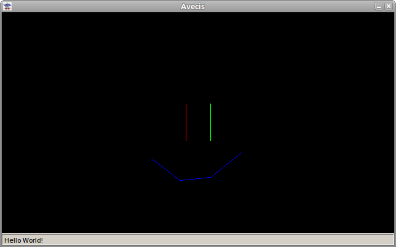
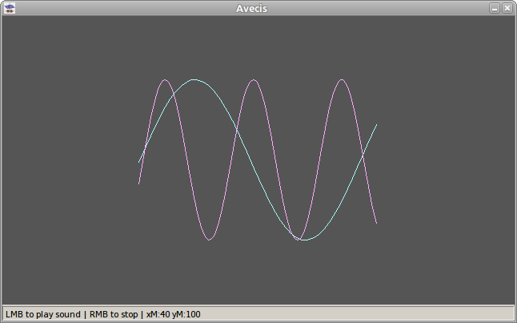
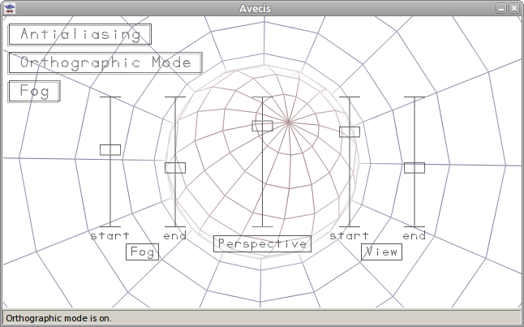
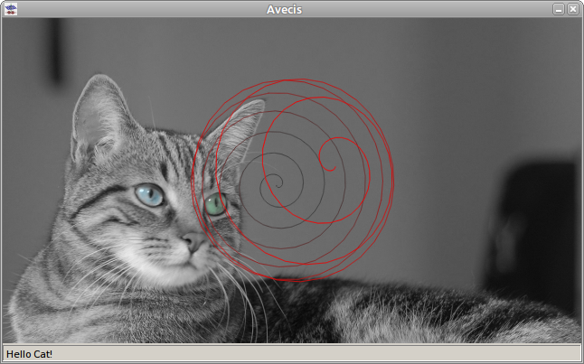

# avecis

A sketch pad is to artists as avecis is to programmers.

Avecis is a programmable window. Sound, graphics, and keyboard/mouse input can all be accessed and programmed through TCP.

___

## hello_world

The program in each of the 'hello_world*' folders demonstrates drawing, printing to the status bar, and playing a sound.

___

## sine

The program in each of the 'sine*' folders demonstrates playing unbroken sound segments.

___

## track_ball

The program in each of the 'track_ball*' folders demonstrates 3D vector graphics.

___

## yarn

The program in each of the 'yarn*' folders demonstrates using 3D vector graphics on top of a raster.

___

## Compiling Avecis

You may need gcc to compile avecis.  
There is both a linux and windows version.

___

## Read Avecis Events Using Putty

It is possible to read events with putty because avecis uses TCP.  

* Run 'avecis -h' in a terminal to get the default port.  
* Run avecis.  
* Run putty.  
* Enter 127.0.0.1 for the host name.  
* Enter the default port.  
* Choose raw for the connection type.  
* Click Open.  

Typing in the avecis window will allow putty to read events.  
Typing in the putty window would likely cause a data error which avecis will then disconnect from the client.  

___

## Accessing Avecis Using Perl and Netcat

Within a bash terminal this code will draw a line in the avecis window given that 27015 is the default port.  

#### perl -e "print pack('C I< f<f<f< f<f<f< C I<',11, 24, -90,-40,0, 90,40,0, 13,0)" | nc 127.0.0.1 27015

Note that avecis does not reset the graphics for each client connection.  

___

## Avecis Command Line Usage

avecis [options]  
  
Options:  
-t [title], changes the window title; the default is 'Avecis'  
-x [x position], changes the x position; the default is 0  
-y [y position], changes the y position; the default is 0  
-w [width], changes the window width; the default is 640  
-h [height], changes the window height; the default is 360  
-p [port], changes the server port; the default is 27015  
-b [buffer size], changes the audio buffer size; the default is 4096  
-s [samples/sec], changes the audio sample rate; the default is 11025  
-u, pops the window up each time a connection is made  
-h, displays this message  
  
Example usage:  
avecis -t 'New Title' -w 400 -h 400 -p 27016 -u  
