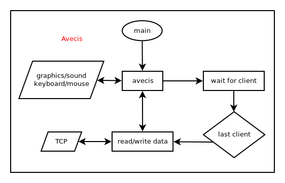

# Avecis Specification

### Description:
Avecis stands for audio, vector, input server and is a programmable window. Sound, graphics, and keyboard/mouse input can all be accessed and programmed through TCP.  

### General Flowchart:

 

___

### Receivable Events:
Data representing keyboard and mouse events as well as "disconnect" and "playing last sound buffer" events can be read through a TCP client.

### Accessible Functions:
There are 16 graphical/audio functions as well as a "print to status bar" and "end transmission" function. These functions along with their machine code are listed below.  

##### Machine Code Format: [1 byte operation code] + [4 byte little-endian integer (data array byte count)] + [data array]
___

#### SET_VIEW_START
Sets the camera lens position in 3D space where lines and paths will be clipped.  

##### Machine Code: 0x00 + 0x04,0x00,0x00,0x00 + [4 byte little-endian float]
___

___

#### SET_VIEW_END
Sets the distance in 3D space where lines and paths will be clipped.  

##### Machine Code: 0x01 + 0x04,0x00,0x00,0x00 + [4 byte little-endian float]
___

___

#### SET_PERSPECTIVE
Sets the perceived scale contrast related to distance in a 3D scene.  

##### Machine Code: 0x02 + 0x04,0x00,0x00,0x00 + [4 byte little-endian float]
___

___

#### SET_ORTHOGRAPHIC_MODE
Sets the view in orthographic mode if true.  

##### Machine Code: 0x03 + 0x01,0x00,0x00,0x00 + [1 byte]
___

___

#### SET_FOG_MODE
Turns fog on if true.  

##### Machine Code: 0x04 + 0x01,0x00,0x00,0x00 + [1 byte]
___

___

#### SET_FOG_COLOR
Sets the color of the fog.  

##### Machine Code: 0x05 + 0x00,0x00,0x00,0x00
___

___

#### SET_FOG_START
Sets the distance at which the fog starts.

##### Machine Code: 0x06 + 0x04,0x00,0x00,0x00 + [4 byte little-endian float]
___

___

#### SET_FOG_END
Sets the distance at which the fog overtakes.

##### Machine Code: 0x07 + 0x04,0x00,0x00,0x00 + [4 byte little-endian float]
___

___

#### SET_ANTIALIASING_MODE
Turns antialiasing on if true.  

##### Machine Code: 0x08 + 0x01,0x00,0x00,0x00 + [1 byte]
___

___

#### SET_COLOR
Sets color used for graphical objects.  
The last color in buffer is used if no color is given.  

##### Machine Code: 0x09 + [4 byte little-endian integer] + [byte array]
___

___

#### CLEAR_SCREEN
Paints each pixel with the color data and resets the z buffer.  

##### Machine Code: 0x0A + 0x00,0x00,0x00,0x00
___

___

#### DRAW_LINE
Draws 3D lines.  

##### Machine Code: 0x0B + [4 byte little-endian integer] + [little-endian float array]
___

___

#### DRAW_PATH
Draws 3D paths.  

##### Machine Code: 0x0C + [4 byte little-endian integer] + [little-endian float array]
___

___

#### SHOW_CONTENT
Displays what has been painted or drawn.  

##### Machine Code: 0x0D + 0x00,0x00,0x00,0x00
___

___

#### PRINT_STATUS
Prints text to the status bar.  

##### Machine Code: 0x0E + [4 byte little-endian integer] + [byte array]
___

___

#### PLAY_SOUND
Plays the given sound data.

##### Machine Code: 0x0F + [4 byte little-endian integer] + [little-endian float array]
___

___

#### STOP_SOUND
Stops sound play before the next buffer.

##### Machine Code: 0x10 + 0x00,0x00,0x00,0x00
___

___

#### END_TRANSMISSION
Ends client/server communication.

##### Machine Code: 0xFF + 0x00,0x00,0x00,0x00
___

